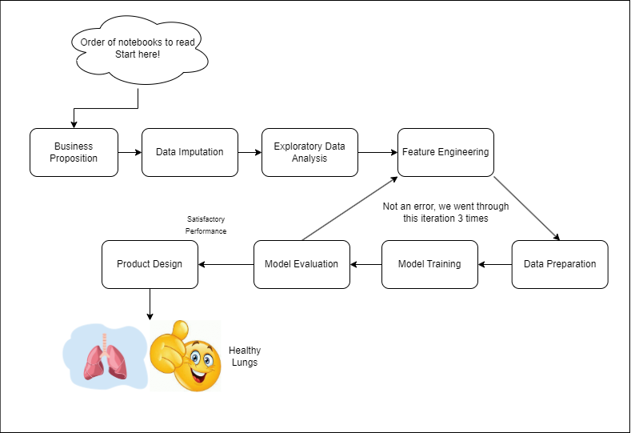

# Welcome to the Air Quality Project

## About
This Mini-Project aims to analyse the PRSA dataset on Multi-State Air Quality in Beijing in an effort to build a solution to manage symptoms of poor air quality. The data originates from the Beijing Municipal Environmental Monitoring Center, with meteorological information at each station sourced from the closest weather station managed by the China Meteorological Administration. The observations span from March 1st, 2013, to February 28th, 2017.
Data set available <a href="https://archive.ics.uci.edu/dataset/501/beijing+multi+site+air+quality+data">here</a>
 

Below is a flowchart of the reccomended path to look at our project.

</img>

In order to make the notebook easier to follow, we have
1. **Abstracted data imputation** codes into a **datacleaning.py**
2. **Abstracted data transformation** functions into **datatransformations.py**
3. Abstracted the cycle shown above (Feature Engineering, Data Preparation, Model Training, Model Evaluation) into a single notebook **showing only evalutation steps** (models will be trained seperately to reduce code redundancy in the notebook).

**All abstractions are available to read in ./scripts**

This is in an effort to reduce the size of the notebook to make it easier to follow **(No one wants to read a monolith that is difficult to read, do they?)**. We wil add the general ideas of what each function does as markdown cells.

## Dataset

This dataset contains hourly records of air pollutant levels from 12 government-monitored air quality stations. The data originates from the Beijing Municipal Environmental Monitoring Center, with meteorological information at each station sourced from the closest weather station managed by the China Meteorological Administration. The observations span from March 1st, 2013, to February 28th, 2017, with any unavailable data marked as "NA."

## Problem statement:
### Air Quality in 

## Feature Engineering Techniques
### Dealing with skew
1. Logarithmic Tranformation
2. Square Root Transformation
3. Cox-Box Transformation
4. Yeo-Johnson Transformation

### Feature Generation
1. Orthogonal Projection
2. Time Series Data Creation

## Models used
### Classical Machine Learning Models (Regression Problems)
1. Random Forest Regressor
2. Adaboost Regressor
3. Linear Regression
4. **Neural Network Regression(MLP Regressor)**
   
### Time Series Models Used (Sequential Regression Problem)
1. LSTM Networks
2. **GRU Networks**

## Solution
### Create idea of how to implement models onto a Simple Reflex Agent with State.

## References

https://www.nature.com/articles/s41561-023-01157-8#:~:text=With%20emptier%20streets%20and%20quieter,and%2023%3A00%20globally4

https://airly.org/en/why-is-air-quality-worse-at-night/#:~:text=But%20at%20night%2C%20the%20ground,pollutants%20close%20to%20the%20surface

https://whnt.com/weather/why-was-it-so-windy-after-storms/

https://www.chinahighlights.com/beijing/weather.htm#:~:text=The%20rainy%20summer%20season%20is,moderate%20to%20heavy%20thundery%20showers.

https://aqli.epic.uchicago.edu/policy-impacts/china-national-air-quality-action-plan-2014/#:~:text=Across%20all%20urban%20areas%2C%20the,20%2C%2015%20percent%2C%20respectively.

https://www.business-standard.com/article/pti-stories/china-has-310-mln-registered-vehicles-385-mln-drivers-in-2017-118011501092_1.html

https://www.sciencedirect.com/science/article/abs/pii/S1352231023001231

https://www.waikatoregion.govt.nz/environment/air/weather-and-air/#:~:text=or%20no%20wind.-,Wind%20speed,in%20dry%20windy%20rural%20areas.

https://www.sciencedirect.com/science/article/abs/pii/S0048969723010501#:~:text=Through%20the%20combined%20effect%20of,autumn%20and%20winter%20in%20YRD.

https://aqicn.org/city/beijing/

https://blissair.com/what-is-pm-2-5.htm

https://textbooks.math.gatech.edu/ila/projections.html

https://archive.ics.uci.edu/dataset/501/beijing+multi+site+air+quality+data

