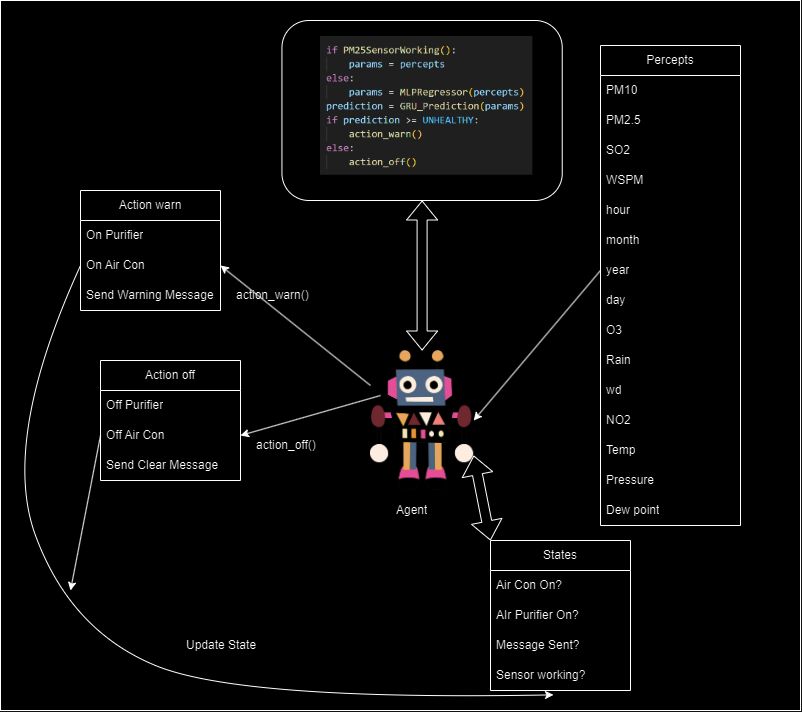

### Product Design

#### Implementation:
We will use a low cost microcomputer (like a raspberry pi) to develop and deploy systems across Beijing.
Reason:
1. Easy to implement (linux based machine)
2. Able to develop in high-performing, high level languages (C, C++)
3. Model can be imported to Raspberry Pi for use through ONNX
4. Cheap
5. Compact

Here is a diagram of what our Simple Reflex Agent will do
</img>

- Our Agent will perceive its environment through sensors and timers
- It will consistently run the algortihm in black to detect if the predicted PM2.5 in the next time step (hour) is beyond the unhealthy mark
  1. If it predicted is unhealthy AND current state is off
   - Turn on air purifier
   - Turn on air con
   - Send Warning Message
   - update states
  2. If predicted is within healthy range AND current state is on
   - Turn off purifier
   - Turn off air con
   - Send Clear message
   - update states

## Thank you for reaching this stage of our project. We hope you enjoyed our Data Science Project, and the uses of our models.